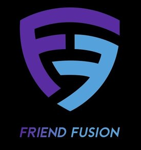

FriendFusion Forum

FriendFusion is an online forum developed using the MERN stack (MongoDB, Express, React, Node.js), designed for users to engage in discussions through posted messages.

Table of Contents
Objective
Main Tasks
Admin Dashboard

The objective of this project is to create a responsive online forum with various functionalities utilizing the MERN stack.

Main Tasks
Homepage Responsiveness
Navbar: Customized navbar displaying website elements, user-specific components, and a dropdown for user settings.
Banner Section: Implementing a search bar based on post tags with backend functionality.
Tags Section: Displaying tags available for post categorization and search.
Announcement Section: Displaying announcements with notification functionality.
Post Listing: Displaying posts in descending order of creation with sorting and pagination options.
Post Details: Implementing detailed views for posts including author info, content, comments, voting, and sharing options.
Membership Page
Creating a membership/payment page with specific privileges for members.
User Dashboard
Dashboard layout with routes for managing user-related functionalities.
Admin Dashboard
Admin Routes: Implementing routes for administrative tasks.
Manage Users: Displaying user information and allowing admin privileges.
Reported Activities: Handling reported comments/activities and necessary admin actions.
Make Announcement: Feature to create and display announcements.

